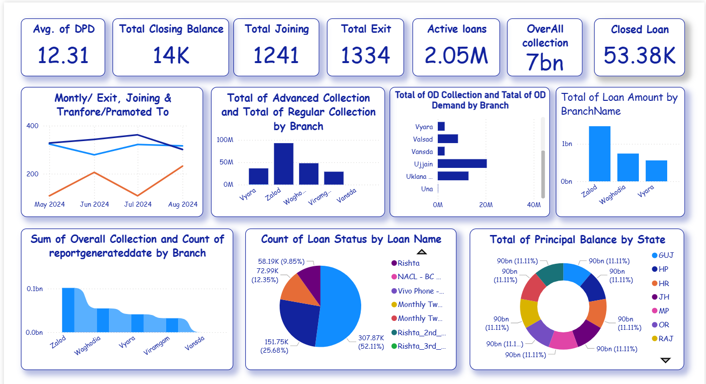

# 📊 Loan Management Dashboard – Python & Power BI

This project presents a comprehensive **Loan Management Analysis** using Python for data preprocessing and Power BI for dashboard creation. The dataset includes information about joining, exits, loans, collections, branches, and states.

---

## 🚀 Features

- 📁 **Data Cleaning & Preprocessing**: Handled missing values, data formatting, and structure using Python (Pandas & NumPy).
- 🔍 **Exploratory Data Analysis**: Identified trends in joining, exits, loan status, and collection efficiency.
- 📊 **Dashboard Creation in Power BI**:
  - Avg. of DPD
  - Monthly Joining, Exit & Transfer
  - Total Loan Amount & Collection
  - Loan Distribution by Branch & State
  - Loan Status by Type
  - Principal Balance Analysis
  - More dynamic visuals using bar, pie, and donut charts

---

## 🧰 Tools & Technologies Used

- **Python (Jupyter Notebook)**
  - Pandas
  - NumPy
  - Matplotlib (optional for testing visuals)
- **Power BI**
  - Slicer, filters, pie chart, bar chart, donut chart
- **GitHub** for version control and sharing

---

## 📷 Dashboard Preview

---

## 📁 Repository Structure

